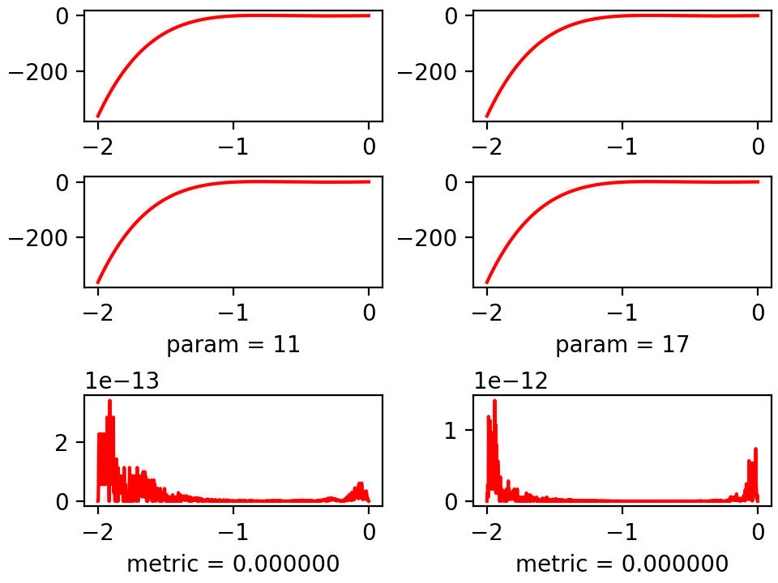

# Решение задачи интерполяции функции одной переменной

[Постановка задачи](Задание.pdf)

## ChangeLog:

    (*) Интерполяция многочленами Лагранжа
    (**) Интерполяция кубическими сплайнами

    Был добавлен метод интерполяции многочленами Лагранжа, согласно задаче. Он 
    показывает хорошие результаты для функции (1) и очень плохие для (2).

    Был добавлен метод интерполяции сплайнами, поскольку сама по себе функция (2)
    не является дифференцируемой в определённых точках, но мы тем не менее можем 
    попытаться приблизить её функцией имеющей непрерывную производную II порядка.
    Можно видеть, что в отличие от метода (1), который на сетке из 17 узлов уже расходиться,
    данный метод только уточняет свои результаты и уже на сетке из 33 узлов даёт
    удовлетворительный результат.

