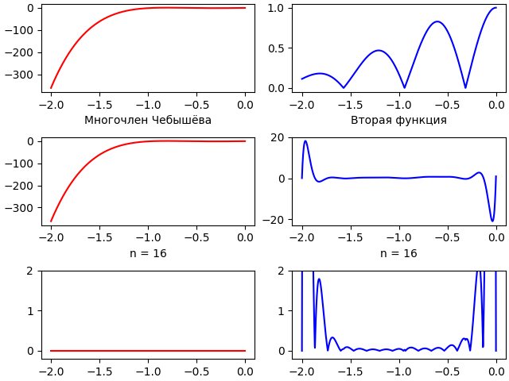
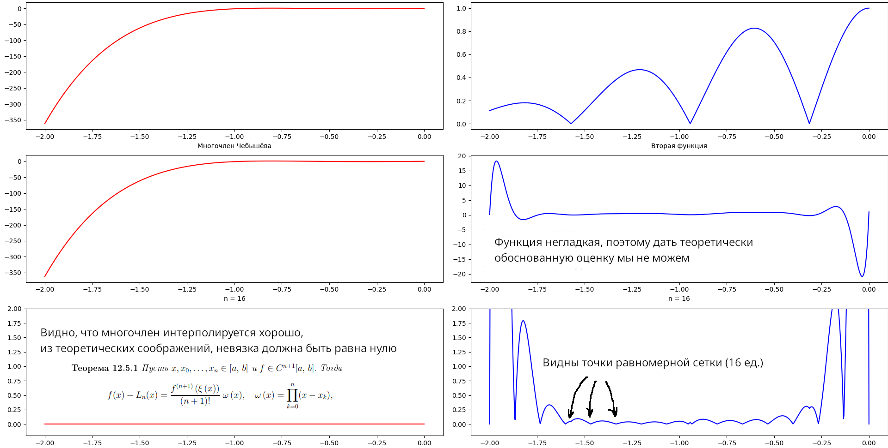

# Решение задачи интерполяции функции одной переменной

[Постановка задачи](Задание.pdf)

## ChangeLog:

    (*) Интерполяция многочленами Лагранжа
    (**) Интерполяция сплайнами порядка m = 3, 5

    Был добавлен метод интерполяции многочленами Лагранжа, согласно задаче. Он 
    показывает хорошие результаты для функции (1) и очень плохие для (2).

    Был добавлен метод интерполяции сплайнами, поскольку сама по себе функция (2)
    не является дифференцируемой в определённых точках, то мы можем по отдельности
    интерполировать её на сегментах, где она дифференцируема, а потом "склеить" их,
    для интерполяции на каждом отдельном сегменте возвращаемся к задаче (1)
    Такой способ показывает результат в разы лучше, чем способ (*), и
    максимальное отклонение ~ 0.07

